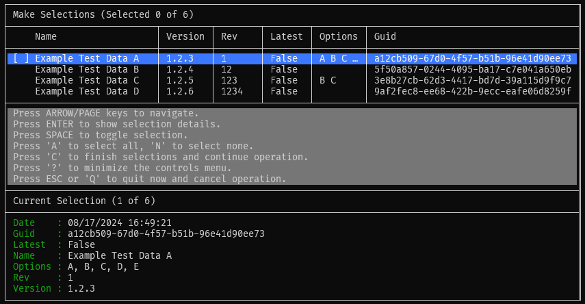
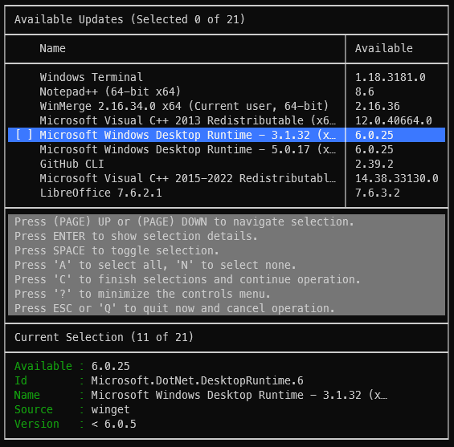

# TableUI PowerShell Module

[](https://www.powershellgallery.com/packages/TableUI)
[](https://www.powershellgallery.com/packages/TableUI)
[](https://www.powershellgallery.com/packages/TableUI)

## Description

This is a simple, no frills UI that accepts an array of objects and displays
each entry in an interactive list where the user can make selections for an
underlying operation.

> [!NOTE]\
> The original scope of this tool was to provide a simple UI for selecting what
 upgradable packages to install for `winget update` but has been expanded on
 to be more general purpose. There is likely room for improvement.

## Installation

Download/install the module from [PSGallery](https://www.powershellgallery.com/packages/TableUI):

```pwsh
Install-Module -Name TableUI -Repository PSGallery
```

Add the module to your `$PROFILE`:

```pwsh
Import-Module TableUI
```

> [!NOTE]\
> This UI uses ANSI escape sequences which may not be supported by all terminals.
 For Windows installations, the latest version of `Windows Terminal` is recommended.

## Usage

`Show-TableUI` is __intended__ to be used with arrays of `PSCustomObject`.
It is __not intended__ to be used with an array of dictionaries.

For example __use__ this form (specifying `[PSCustomObject]`):

```pwsh
$tableData = @(
  [PSCustomObject]@{Name = 'Test A'; Version = '1.2.3'},
  [PSCustomObject]@{Name = 'Test B'; Version = '1.2.5'}
)
```

And __avoid__ this form:

```pwsh
$tableData = @(
  @{Name = 'Test A'; Version = '1.2.3'},
  @{Name = 'Test B'; Version = '1.2.5'}
)
```

This cmdlet works great with `ConvertFrom-` cmdlets, such as `ConvertFrom-Json`
where the data conveys an array of objects with its fields as `NoteProperties`.

Below is an example showing type handling across multiple columns, additional
parameters such as `-SelectedItemMembersToShow` can be added as needed.

```pwsh
$tableData = @(
  [PSCustomObject]@{Name = 'Example Test Data A'; Version = '1.2.3'; Rev = 1; Latest = $false; Options = @('A', 'B', 'C', 'D', 'E') },
  [PSCustomObject]@{Name = 'Example Test Data B'; Version = '1.2.4'; Rev = 12; Latest = $false },
  [PSCustomObject]@{Name = 'Example Test Data C'; Version = '1.2.5'; Rev = 123; Latest = $false; Options = @('B', 'C') },
  [PSCustomObject]@{Name = 'Example Test Data D'; Version = '1.2.6'; Rev = 1234; Latest = $false },
  [PSCustomObject]@{Name = 'Example Test Data E'; Version = '1.2.7'; Rev = 12345; Latest = $false },
  [PSCustomObject]@{Name = 'Example Test Data F'; Version = '1.2.8'; Rev = 123456; Latest = $true }
)

$selections = @()
Show-TableUI -Table $tableData -Selections ([ref]$selections) -DefaultMemberToShow @('Name', 'Version', 'Rev', 'Latest', 'Options')
```



Here is an example of interfacing `winget update` with TableUI utilizing
`ConvertFrom-TextTable` module (also available in [PSGallery](https://www.powershellgallery.com/packages/TextTable)). This example
specifies multiple members for `DefaultMemberToShow`. This results in multiple
columns being rendered in the UI for the associated UI. The first member is
always given priority, if it cannot fit within the UI, the right-most columns
will be dropped to make space for it. A visual indicator is used to indicate
that the table is not showing all columns in the UI (via the use of vertical
double-bars on the right side of the UI).

```pwsh
Install-Module -Name TextTable -Repository PSGallery
Import-Module TextTable

$selections = @()
$tableData = winget update | ConvertFrom-TextTable
$tableData | Show-TableUI -DefaultMemberToShow Name,Available -Selections ([ref]$selections) -Title 'Available Updates'
```

> [!NOTE]\
> By default an array of Booleans is assigned to the value specified for
  `-Selections`. This behavior can be changed to store `Indices` or
  `Items` via the `-SelectionFormat` parameter. However, please note, that
  this is a final transformation of the data. While the UI is processing this
  request the underlying logic always utilizes an array of Booleans. It is
  only at the conclusion of the operation that this variable is updated to
  the desired form.



## Selection Details Script Block

A custom handler may be defined for the `ENTER` key by specifying the
`-EnterKeyScript` parameter.

The assigned script block takes two parameters.

The first parameter is the array indicating the current selections (passed by
value).

The second parameter is the currently selected index. Full access to the
currently selected object and other selections may be realized with appropriate
scoping.
